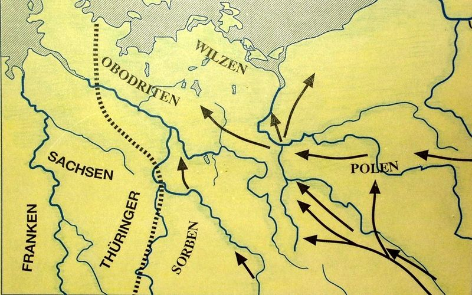

# Славяне в Германии: краткий исторический очерк

*Источник на немецком языке [здесь](https://slawenburgen.hpage.com/geschichte.html).*

После того как германцы по большей части покинули регионы к востоку от Эльбы и Заале, в VII и VIII веках там поселились славянские племена, пришедшие из Восточной и Центральной Европы. Откуда именно они иммигрировали - пока не ясно. В качестве их исходной территории чаще всего рассматриваются земли между Днепром и Вислой (нынешняя восточная Польша и Украина). Перемещение славян на запад было одним из массовых переселений в юго-восточной и центральной Европе в середине I тысячелетия. Толчок этому движению дало продвижение конных орд аварцев из степей Средней Азии в Европу. Древнейшие славянские группы пришли в район Эльбы-Заале из Богемии вдоль Эльбы. К ним присоединились другие племенные группы, некоторые из которых пересекали территорию к востоку от Одера. 

Во времена Карла Великого (747-814) славяне жили на территории, которая простиралась от северо-востока Баварии через Тюрингию, далее в регион Эльбы до восточной части земли Шлезвиг-Гольштейн. Постоянные конфликты с Каролингской, а затем и с Восточно-Франкской империей на западе и с датчанами на севере сформировали богатую событиями историю славян. При этом - по-разному от региона к региону и время от времени - чередовались независимость, зависимость от Дани и полное подчинение. В 928/29 году славянское племя сорбов, проживавшее к югу от линии Магдебурга - Бранденбург-на-Гавеле, впервые подверглось германскому завоеванию. Наступление на славян стало неотъемлемой частью внешней политики  вновь созданной  при Генрихе I, отце императора Оттона I Священной Римской империи германской нации. Дальнейшая история славянского населения с тех пор происходили под мощным экономическим, социальным и юридическим влиянием восточной части Франкской империи.

С другой стороны, многочисленные попытки включить населенные славянами северные территории в состав Восточной Франкской империи потерпели неудачу. В 983 году Лютичское восстание положило конец всем попыткам саксов закрепиться между Эльбой и Одером. Лютичи были объединением славян, в состав которых входили вильцы и часть сорбов. Это образование сохраняло свою политическую независимость до середины 12 века. Со временем они под влиянием немецких социально-политических реалий утратили свою культурную независимость. 

Эйнхард, биограф Карла Великого, сообщает, что Карл унаследовал Эльбу и Заале от своих отцов как границу, отделяющую его государство от славян. Но две эти реки никогда не образовывали резкой разделительной линии. Присутствие славян было доказано во многих случаях к западу от нее на основе археологических находок, письменных источников и географических названий. Но они селились там под властью франков, а затем и Германии и были лишены возможности  дальнейшего независимого развития, что все еще имеет место и сегодня. Археологя подтверждает это предположение: к западу от Эльбы и Заале не было постоянных характерных славянских укреплений, которые всегда свидетельствуют о том, кто доминирует в регионе. К западу от Эльбы Карл Великий и его преемники не могли допустить создания постоянных славянских поместий.

Наследие славян очень неравномерно распределено по земле между Эльбой и Одером из-за природных условий. Районы интенсивного заселения отделялись друг от друга обширными лесными массивами. В ландшафтах поселений могут быть локализованы племена, известные по письменным источникам. В частности, анонимный баварский географ середины IX века называет  civitates (укрепленные районы), принадлежащие ободритам с несколькими подплеменами, вильцам с четырьмя подплеменами, линонам, хевелерам, сорбам с несколькими подплеменами, далеминцам, лужицким славянам, мильценерам, безунцам. Другие письменные источники дополняют этот список. 

Под civitates следует понимать обнаруживаемые археологически поселения с окрестностями. Это были регионы, через которые можно было легко пройти примерно за день. В центре почти всегда находилось укрепление, вокруг которого группировались тяготеющие к нему деревни. Сегодняшние остатки укреплений имеют самые разные формы и неоднократно привлекали внимание археологов. Они выделяют два разных типа крепостей, построенных из дерева и земли: крепости на вершинах холмов и низовые крепости, которые строили на островах и полуостровах. Иногда укрепления располагались одновременно и на вершинах, и на острове, как, например, в Берен-Любчине (Мекленбург). 

Часто поселения защищали круговыми стенами, хотя на полуостровах и горных отрогах достаточно было укрепить лишь входную сторону, а на естественно защищенных сторонах было достаточно простых палисадов, живых изгородей и т.д. Как и в случае с крепостью Дренсе в Бранденбурге, укрепления часто состояли из нескольких частей, с одним или даже несколькими форпостами перед главным замком. Это особенно заметно в Вильцене (Мекленбург). Купцы, ремесленники, и слуги знати жили внутри укреплений, так что эти военные комплексы часто становились ядром средневековых городов.

<!--
# Geschichte der Slawen in Deutschland

Nachdem die Germanen die Landschaften östlich von Elbe und Saale im
heutigen Deutschland weitgehend verlassen hatten, siedelten sich dort
seit dem 7./8. Jahrhundert slawische Stämme aus Ost- und
Ostmitteleuropa an. Von woher sie ganz genau einwanderten, ist noch
nicht eindeutig geklärt. Jedoch kommt als ihre Heimat der Raum zwischen
Dnepr und Weichsel infrage (heutiges Ostpolen und Ukraine). Der Zug der
Slawen nach Westen gehörte zu den umfangreichen Bevölkerungsbewegungen
in Südost- und Mitteleuropa um die Jahrtausendmitte. Auslöser dafür war
das Vordringen des Reitervolks der Awaren aus den Steppen Mittelasiens
nach Europa. Die ältesten slawischen Gruppen erreichten von Böhmen her
entlang der Elbe das Elbe-Saale-Gebiet. Ihnen schlossen sich weitere
Stammesgruppen an, die teilweise auch über den Raum östlich der Oder
kamen. Zur Zeit Karls des Großen (747 - 814) lebten die Slawen in einem
Gebiet, welches von Nordostbayern über Thüringen, weiter in das
Elbegebiet bis ins östliche Schleswig-Holstein reichte. Ständige
Auseinandersetzungen mit dem karolingischen und später ostfränkischen
Reich im Westen und im Norden auch mit den Dänen prägten die
ereignisreiche Geschichte der Slawen. Dabei wechselten - regional und
zeitlich unterschiedlich - Selbstständigkeit, Tributabhängigkeit und
völlige Unterwerfung einander ab. Zuerst unterlag 928/29 der slawische
Stamm der Sorben - südlich einer Linie von Magdeburg nach Brandenburg
an der Havel - den Eroberungen, die vom gerade erst entstandenen Reich
unter Heinrich I., dem Vater von Kaiser Otto I., ausgingen. Die weitere
Geschichte dieser slawischen Bevölkerung und ihre Entwicklung verlief
fortan nur noch unter Bedingungen, die in wirtschaftlicher, sozialer
und rechtlicher Hinsicht von ostfränkischer Herrschaft bestimmt
wurden.

Im Norden hingegen schlugen viele Versuche fehl, von Slawen besiedeltes
Gebiet dauerhaft dem ostfränkischen Reich einzugliedern. So bereitete
983 der "Lutizenaufstand" allen ostfränkisch-sächsischen Versuchen ein
Ende, zwischen Elbe und Oder Fuß zu fassen. Bei den Lutizen handelte es
sich um einen Zusammenschluss von Slawen, und zwar der wilzischen
Teilstämme gemeinsam mit den Lusizi und Teilen der Sorben. Bis zur
Mitte des 12. Jahrhunderts behielten dann diese Slawen ihre politische
Unabhängigkeit. Erst danach wurden auch sie in deutsche Sozial- und
Wirtschaftsverhältnisse einbezogen und verloren dann im Laufe der Zeit
auch ihre kulturelle Eigenständigkeit. Einhard, der Biograf Karls des
Großen, berichtet, Karl habe von seinen Vätern Elbe und Saale als
Grenze gegen die Slawen übernommen. Die Linie der beiden Flüsse bildete
aber niemals eine scharfe Trennlinie. Vielmehr ist auch westlich davon
aufgrund von archäologischen Funden, zeitgenössischen Schriftquellen
und Ortsnamen vielfach die Anwesenheit von Slawen nachgewiesen. Sie
siedelten dort aber unter fränkischer und später deutscher
Oberherrschaft. Daher gab es bei ihnen keine eigenständige
Weiterentwicklung, die bis heute nachwirkt.

Eine von Archäologen belegte Tatsache begründet diese Annahme:

Westlich von Elbe und Saale gab es nach heutigem Kenntnisstand keine
dauerhaften charakteristischen slawischen Burgen. Befestigungsanlagen
sind nämlich immer Ausdruck und Symbol, wer die Befehlsgewalt in der
umliegenden Region ausübt. Westlich der Elbe konnten Karl der Große und
seine Nachfolger daher nicht dulden, dass dort dauerhafte slawische
Herrschaftssitze enstanden.
Die Hinterlassenschaften der Slawen verteilen sich wegen der
naturgegebenen Voraussetzungen sehr ungleichmäßig über das Land
zwischen Elbe und Oder. Gegenden intensiver Besiedlung waren durch
umfangreiche Waldgebiete voneinander getrennt. In den
Siedlungslandschaften lassen sich Stämme lokalisieren, die aus der
schriftlichen Überlieferung bekannt sind, insbesondere vom "Bayrischen
Geographen" aus der Mitte des 9. Jahrhunderts. Er nennt die ihnen
zugehörigen civitates (Burgbezirke), u.a. Abodriten mit mehreren
Teilstämmen, Wilzen mit vier Teilstämmen, Linonen, Heveller, Sorben mit
mehreren Teilstämmen, Daleminzer, Lusizer, Milzener, Besunzanen. Andere
Schriftquellen ergänzen diese Aufzählung. Unter civitates sind die
archäologisch fassbaren Siedlungskammern zu verstehen. Es handelte sich
um kleinere Regionen von einer Ausdehnung, die in etwa einem
Tagesmarsch gut zu durchqueren war. Im Zentrum lag fast immer eine Burg
und darum herum gruppierten sich die zugehörigen Siedlungen. Die
heutigen Reste der Befestigungsanlagen besitzen vielfältige
Ausprägungen und ziehen immer wieder die Aufmerksamkeit der Archäologie
auf sich. Es gab zwei verschiedene Arten der Burgen, die durchweg aus
Holz und Erde gebaut waren. Je nach Lage in der Landschaft waren sie
unterschiedlich gestaltet:

"Höhenburgen" der bergigen Landschaften lagen bevorzugt auf
Bergspornen oder Bergkuppen; "Niederungsburgen" des Flachlandes
befanden sich - sofern vorhanden - auf Inseln und Halbinseln, um den
Schutz des umgebenen Wassers oder Sumpfes zu nutzen. Auf Kuppen und
Inseln, wie z. B. in Behren-Lübchin in Mecklenburg, sicherten häufig so
genannte Ringwälle die Ansiedlungen. Auf Halbinseln und Bergspornen
hingegen reichte es aus, die Zugangsseite massiv zu gefestigen, während
an den natürlich geschützten Seiten einfachere Palisaden, Hecken usw.
genügten. Häufig waren die Anlagen wie im Falle der Burg Drense in
Brandenburg mehrteilig, indem der eigentlichen Hauptburg eine oder gar
mehrere Vorburgen vorgelagert waren. Dies ist besonders bei den Wilzen
in Mecklenburg zu erkennen. In den Vorburgen waren vor allem
gewerbliche Produzenten, Händler und Dienstleute ansässig, so dass
diese Burg-/Vorburg-Komplexe häufig zu Keimzellen der mittelalterlichen
Städte wurden.
-->
